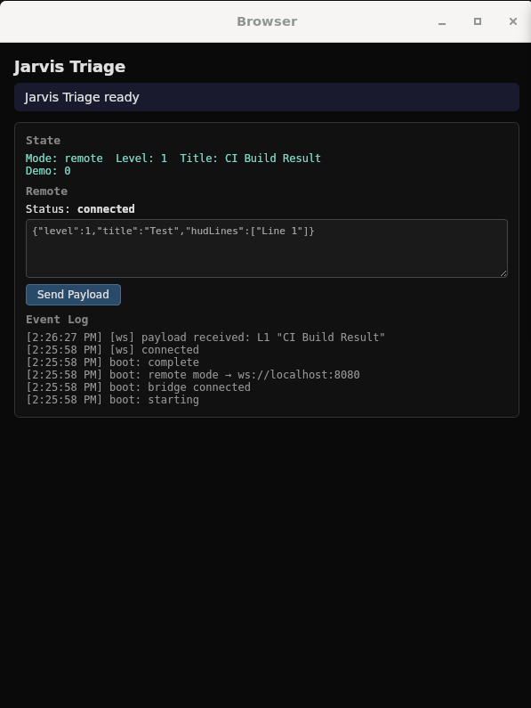
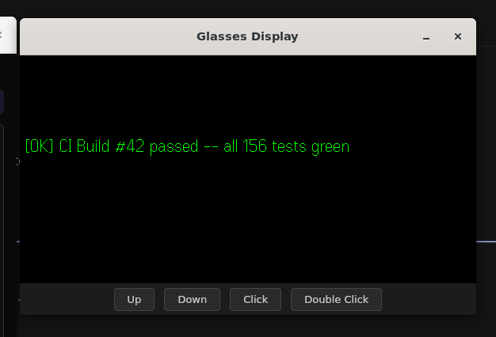
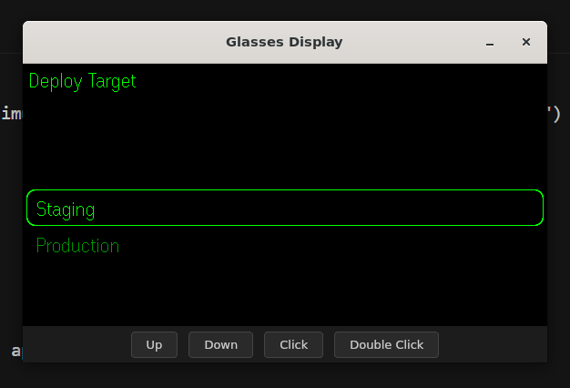
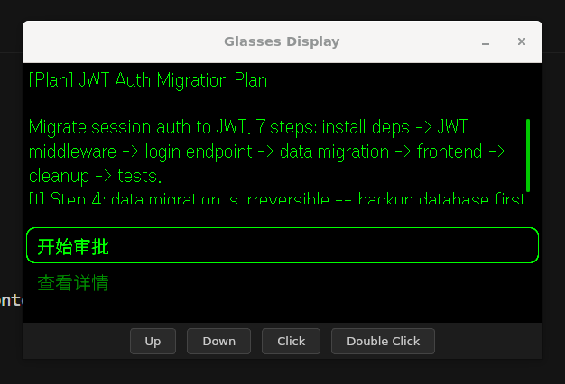

# Jarvis Triage

> Information compression layer for AR HUD interaction. Not tied to any specific AI platform.

Jarvis Triage compresses verbose AI output into a layered format optimized for **4-line AR HUD + ring interaction**. Feed it a 50-line plan, get back a structured approval flow you can complete without touching your phone.

## Architecture

```
Upstream            Relay Server         App (WebView)        Even G2 HUD
(AI / CI / Bot)     ws://localhost:8080   localhost:5173       Smart Glasses
     |                    |                    |                    |
     | POST /push         |                    |                    |
     | (TriagePayload)    |                    |                    |
     |------------------->|                    |                    |
     |                    | WS: payload        |                    |
     |                    |------------------->|                    |
     |                    |                    | SDK render         |
     |                    |                    |------------------->|
     |                    |                    |                    | User taps ring
     |                    | WS: decision       |                    |
     |                    |<-------------------|                    |
     |                    |                    |                    |
```

## Triage Levels

| Level | Type | HUD Output | Interaction |
|-------|------|------------|-------------|
| 0 | Silent | None | None |
| 1 | Notify | 1 line | View only |
| 2 | Quick Decision | Question + 2-3 options | Tap to select |
| 3 | Info Decision | Context + options | Tap to select |
| 4 | Plan Review | Multi-step approval flow | Sequential decisions + confirm |

## Quick Start

```bash
# 1. Start the relay server
cd server && npm install && npm run dev

# 2. Start the app (in another terminal)
cd app && npm install && npm run dev

# 3a. Open in simulator (preferred — simulates G2 display + ring input)
evenhub-simulator "http://localhost:5173?ws=ws://localhost:8080"

# 3b. Or open in browser (works on any OS including WSL2)
#     Navigate to: http://localhost:5173?ws=ws://localhost:8080
#     Use the "Simulate Ring Input" buttons (Scroll Up / Click / Scroll Down)
#     to interact with L2/L3/L4 decision flows
```

## Modes

### Remote Mode (default with `?ws=`)

Push payloads from any system via the relay server:

```bash
# Push a notification
curl -X POST http://localhost:8080/push \
  -H 'Content-Type: application/json' \
  -d '{"level":1,"title":"Build passed","source":"ci","hudLines":["[OK] Build #42 passed"]}'

# Push a decision
curl -X POST http://localhost:8080/push \
  -H 'Content-Type: application/json' \
  -d '{"level":2,"title":"Deploy target","source":"deploy-bot","decisions":[{"question":"Deploy where?","options":[{"label":"Staging"},{"label":"Production"}]}]}'
```

User responses (decisions, approvals) are sent back through the same WebSocket connection. See [PROTOCOL.md](PROTOCOL.md) for the full schema.

### Demo Mode

Open the app without `?ws=` or use the built-in demo:

```bash
evenhub-simulator http://localhost:5173
```

- **Double-click** to cycle through Level 0-4 demo scenarios
- **Click** to select options / confirm
- **Scroll** to navigate lists

## Demo Screenshots

| Dev Panel | L1 — Notification |
|:-:|:-:|
|  |  |
| Browser-side debug panel showing remote mode, WebSocket connected, and event log. | Glasses HUD displaying a one-line CI build notification. |

| L2 — Quick Decision | L4 — Plan Review |
|:-:|:-:|
|  |  |
| Ring-selectable deploy target with Staging / Production options. | Multi-step JWT migration plan with summary, risks, and approval flow. |

## MCP Server (Claude Code Integration)

The MCP server lets Claude Code natively push triage payloads to the Even G2 HUD and receive user responses.

### Setup

1. Start the relay server: `cd server && npm run dev`
2. Install MCP dependencies: `cd mcp && npm install`
3. The `.mcp.json` in the repo root auto-configures Claude Code when you open the project.

### Tools

| Tool | Description |
|------|-------------|
| `jarvis_status` | Check relay server connectivity and client count |
| `jarvis_notify` | Send a one-line notification to HUD (Level 1) |
| `jarvis_decide` | Push a decision and wait for user selection (Level 2/3) |
| `jarvis_approve` | Push a multi-step plan approval flow (Level 4) |

### Manual Testing

```bash
cd mcp && npx @modelcontextprotocol/inspector npx tsx src/index.ts
```

### Environment Variables

| Variable | Default | Description |
|----------|---------|-------------|
| `JARVIS_RELAY_URL` | `http://localhost:8080` | Relay server HTTP URL |
| `JARVIS_RELAY_WS_URL` | (derived from HTTP URL) | Relay server WebSocket URL |
| `JARVIS_SOURCE` | `claude-code` | Default source identifier |

## LLM Tool Integration

The system has two integration paths. Any LLM tool can push to the HUD — no per-tool adaptation needed.

| Path | Tools | Push | Receive Response |
|------|-------|------|-----------------|
| **MCP (stdio)** | Claude Code | `jarvis_decide` / `jarvis_approve` | Built-in — waiter blocks until user responds |
| **HTTP POST** | Codex, Cursor, curl, any script | `POST /push` | Connect via WS and listen for `decision`/`approval` messages |

Claude Code auto-discovers the MCP server via `.mcp.json` in the repo root. For other tools, push payloads via HTTP and optionally listen on WebSocket for responses (see [PROTOCOL.md](PROTOCOL.md) section 6).

## Protocol

The relay server accepts `TriagePayload` JSON via `POST /push` and forwards it to all connected WebSocket clients. Client responses use typed messages (`decision` for L2/L3, `approval` for L4).

Full specification: [PROTOCOL.md](PROTOCOL.md)

## Testing

```bash
# App tests
cd app && npm test          # Unit tests (vitest)
cd app && npx tsc --noEmit  # Type check

# MCP tests (52 unit + 15 integration = 67 total)
cd mcp && npm test          # Unit + integration tests
```

The MCP integration tests start an embedded relay server on a random port and exercise the full `RelayClient ↔ relay ↔ simulated app` chain over real TCP/WebSocket connections. Only `config` is mocked (to inject the dynamic port); `fetch()` and `WebSocket` are real.

## File Structure

```
jarvis-triage/
├── SKILL.md                        # OpenClaw skill definition
├── PROTOCOL.md                     # Wire protocol specification
├── CHANGELOG.md                    # Release notes
├── BP.md                           # Business plan (Chinese)
├── assets/images/                  # Demo screenshots (simulator + HUD)
├── references/
│   ├── triage-levels.md            # Level definitions + edge cases
│   └── plan-mode-examples.md       # Plan type examples
├── scripts/
│   ├── demo.sh                     # Push sample payloads to relay
│   ├── ai-backend-demo.sh         # Simulate AI-to-HUD pipeline
│   ├── auto-triage-demo.sh        # Simulate automatic event triage
│   └── start-demo.sh              # One-command full demo environment
├── mcp/                            # MCP server (Claude Code integration)
│   ├── package.json
│   ├── tsconfig.json
│   └── src/
│       ├── index.ts                # MCP entry point (stdio transport)
│       ├── types.ts                # Shared triage types
│       ├── config.ts               # Env-based configuration
│       ├── relay-client.ts         # HTTP + WebSocket relay client
│       ├── __tests__/
│       │   ├── config.test.ts     # Config env-var tests
│       │   ├── relay-client.test.ts # Unit tests (mock WS)
│       │   ├── tools.test.ts      # MCP tool handler tests
│       │   └── integration.test.ts # Integration tests (real relay)
│       └── tools/                  # MCP tool implementations
│           ├── status.ts           # jarvis_status
│           ├── notify.ts           # jarvis_notify
│           ├── decide.ts           # jarvis_decide
│           └── approve.ts          # jarvis_approve
├── server/                         # WebSocket relay server
│   ├── index.ts                    # Express + ws relay
│   └── package.json
├── app/                            # Even Hub App (G2 smart glasses)
│   ├── app.json                    # Even Hub manifest
│   ├── index.html
│   ├── package.json
│   ├── vite.config.ts
│   ├── vitest.config.ts
│   └── src/
│       ├── main.ts                 # Boot: bridge → state → events → render
│       ├── bridge.ts               # SDK bridge wrapper
│       ├── types.ts                # TriagePayload, Decision, AppState
│       ├── state.ts                # Global app state
│       ├── events.ts               # Ring/touch event normalization
│       ├── renderer/               # HUD layout engine
│       ├── levels/                 # Level 0-4 handlers
│       ├── remote/                 # WebSocket client + protocol types
│       ├── demo/                   # Demo mode scenarios
│       └── __tests__/              # Unit tests (vitest)
└── README.md
```

## Roadmap

- [x] Core SKILL.md with Level 0-4 triage logic
- [x] Even Hub App: HUD rendering + ring interaction + demo mode
- [x] WebSocket relay server + remote payload input
- [x] Protocol spec (PROTOCOL.md)
- [x] End-to-end demo scripts
- [x] AI backend integration (MCP server for Claude Code)
- [x] MCP unit tests (52) + integration tests with real relay (15)
- [x] Browser-based sim buttons for testing without simulator/glasses
- [ ] Voice capture (G2 quad-mic -> PCM -> STT)
- [ ] Auto-triage hooks (no manual trigger needed)
- [ ] HTTP long-poll endpoint for non-MCP tools (Codex, Cursor, etc.)

## Changelog

See [CHANGELOG.md](CHANGELOG.md) for release notes.

**Latest: v0.2.0** — MCP server for Claude Code, 67 tests, browser sim buttons, LLM tool integration docs.

## License

MIT
